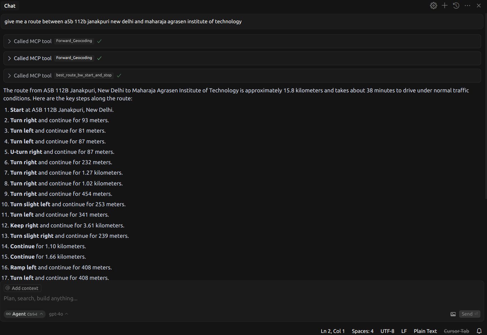
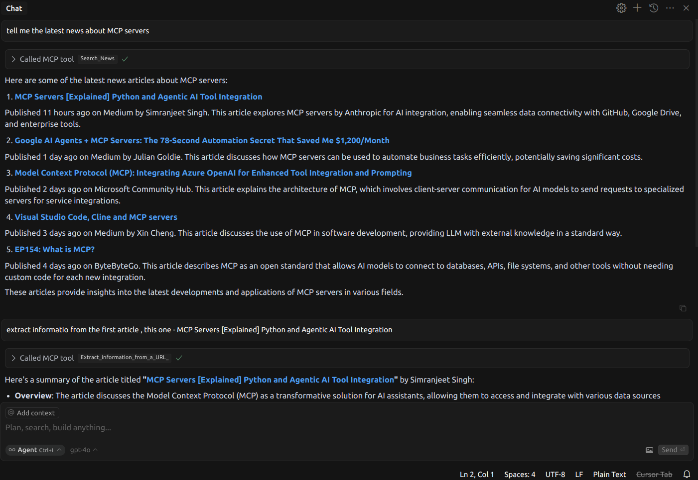
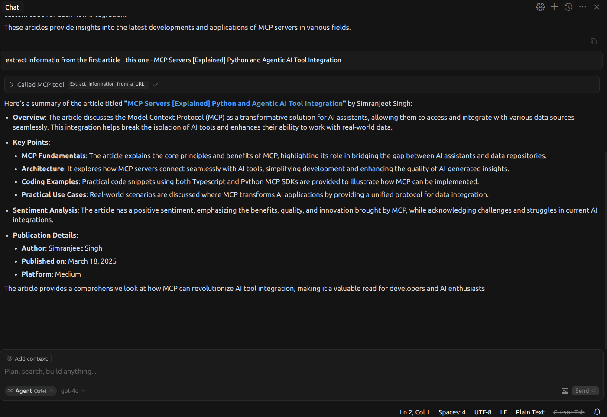
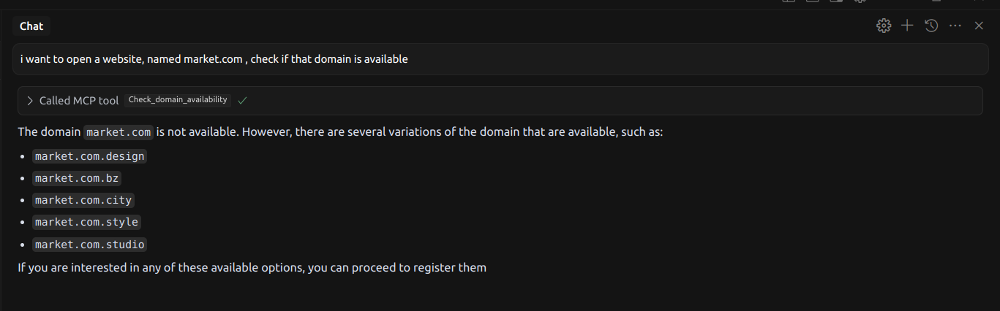

# API-MARKET MCP Server

## About
A Model Context Protocol (MCP) server that exposes API-Market's endpoints as MCP resources. This server allows Large Language Models to discover and interact with APIs defined by OpenAPI specifications through the MCP protocol.  
This repository provides access to the APIs available at [API.market](https://api.market/). The tool is free to use and allows agents to communicate freely with all available APIs, making it super powerful. With over **200+ APIs** available at [API.market](https://api.market/), you can leverage a wide range of functionalities.

## Quick Start

You do not need to clone this repository to use this MCP server. You can simply configure it in your client of choice.

### For Claude Desktop
1. Locate or create your Claude Desktop configuration file:
   - On macOS: `~/Library/Application Support/Claude/claude_desktop_config.json`
2. Add the following configuration to enable the API-Market MCP server:
   ```json
   {
     "mcpServers": {
       "api-market": {
         "command": "npx",
         "args": ["-y", "@noveum-ai/mcp-server"],
         "env": {
           "API_HEADERS": "x-magicapi-key:your-api-key"
         }
       }
     }
   }
   ```
### For Cursor
1. Go to File -> Preferences -> Cursor Settings.
2. Select MCP.
3. Click on Add new global MCP Server.
4. Paste the following into the mcp.json file.

```json
  {
    "mcpServers": {
      "api-market": {
        "command": "npx",
        "args": [
          "-y",
          "@noveum-ai/mcp-server",
          "--headers",
          "x-magicapi-key:<your-api-key>"
        ]
      }
    }
  }
```
Alternatively, add this as the first entry in mcpServers.
```json  
    "api-market": {
      "command": "npx",
      "args": [
        "-y",
        "@noveum-ai/mcp-server",
        "--headers",
        "x-magicapi-key:<your-api-key>"
      ]
    },
```
5. For older versions of Cursor, add the following command after clicking on Add new MCP server 
```bash
npx -y @noveum-ai/mcp-server --headers x-magicapi-key:your-api-key
```
## Getting an API Key from API.market

 To obtain an API key
 1. Log in to [API.market](https://api.market/)
 2. Go to your profile and select 'My API Keys'
 3. Your API keys will be displayed here

## List of APIs in this MCP

- [GET-trueway-matrix-MatrixService-CalculateDrivingMatrix](https://api.market/store/trueway/matrix)
- [GET-magicapi-whisper-predictions--request_id](https://api.market/store/magicapi/whisper)
- [POST-magicapi-whisper-whisper](https://api.market/store/magicapi/whisper)
- [POST-capix-faceswap-upload](https://api.market/store/capix/faceswap)
- [POST-capix-faceswap-faceswap-v1-image](https://api.market/store/capix/faceswap)
- [POST-capix-faceswap-faceswap-v1-video](https://api.market/store/capix/faceswap)
- [POST-capix-faceswap-result](https://api.market/store/capix/faceswap)
- [GET-trueway-geocoding-GeocodingService-Geocode](https://api.market/store/trueway/geocoding)
- [GET-trueway-geocoding-GeocodingService-ReverseGeocode](https://api.market/store/trueway/geocoding)
- [POST-magicapi-dnschecker-dnschecker](https://api.market/store/magicapi/dnschecker)
- [GET-magicapi-coder-predictions--request_id](https://api.market/store/magicapi/coder)
- [POST-magicapi-coder-coder](https://api.market/store/magicapi/coder)
- [POST-bridgeml-nsfw-detection-nsfw_detection](https://api.market/store/bridgeml/nsfw)
- [GET-magicapi-whois-whois--domain-](https://api.market/store/magicapi/whois)
- [GET-magicapi-deblurer-predictions--request_id](https://api.market/store/magicapi/deblurer)
- [POST-magicapi-deblurer-deblurer](https://api.market/store/magicapi/deblurer)
- [POST-bridgeml-text-to-image-text_to_image](https://api.market/store/bridgeml/text)
- [GET-magicapi-period-predictions--request_id](https://api.market/store/magicapi/period)
- [POST-magicapi-period-period](https://api.market/store/magicapi/period)
- [GET-trueway-places-PlacesService-FindPlaceByText](https://api.market/store/trueway/places)
- [GET-trueway-places-PlacesService-FindPlacesNearby](https://api.market/store/trueway/places)
- [GET-magicapi-hair-predictions--request_id](https://api.market/store/magicapi/hair)
- [POST-magicapi-hair-hair](https://api.market/store/magicapi/hair)
- [POST-bridgeml-codellama-bridgeml-codellama](https://api.market/store/bridgeml/codellama)
- [GET-brave-brave-videos-search](https://api.market/store/brave/brave)
- [GET-brave-brave-web-search](https://api.market/store/brave/brave)
- [GET-brave-brave-images-search](https://api.market/store/brave/brave)
- [GET-brave-brave-news-search](https://api.market/store/brave/brave)
- [GET-brave-brave-suggest-search](https://api.market/store/brave/brave)
- [GET-brave-brave-spellcheck-search](https://api.market/store/brave/brave)
- [POST-magicapi-domainchecker-check_domains](https://api.market/store/magicapi/domainchecker)
- [GET-trueway-routing-DirectionsService-FindDrivingRoute](https://api.market/store/trueway/routing)
- [GET-trueway-routing-DirectionsService-FindDrivingPath](https://api.market/store/trueway/routing)
- [POST-pipfeed-parse-extract](https://api.market/store/pipfeed/parse)

## Example and Usage
### Example 1
We can use the agent to find a route between any two points



### Example 2
We can use the agent to find news about any topic, and then dig deeper into the articles




### Example 3
We can use the agent to look for available domains



## Development

### Adding a New API to the MCP Server

The `utils` folder contains helper scripts for managing API configurations, parsing OpenAPI specifications, and registering new APIs into the MCP server.

#### 1. Locate the OpenAPI Specification
Find the OpenAPI JSON for the API you want to integrate. After that, create a folder `json_files` in the root directory of the project and add your OpenAPI JSON spec to the folder

#### 2. Modify the OpenAPI Specification
After obtaining the OpenAPI spec, use `modify_api.py` to update the path inside the spec to include the file name.

```bash
python modify_api.py
```

#### 3. Update API Summaries
After modifying the paths, update the API summaries by choosing one of the following options:

- **Automatically shorten summaries using an LLM:**

```bash
python shorten_summary_in_specs.py 
```

- **Manually update the summaries:**

```bash
python manual_summary_shortner.py 
```

#### 4. Build and Test

Rebuild the project to apply the changes:

```bash
npm run build
```

Then, test the new API integration using:

```bash
npm run inspect
```

#### 5. Submit Your Changes
If you want to contribute this new API to the repository:
- Fork the repo.
- Create a branch.
- Submit a pull request (PR).

#### 6. Publish the MCP server (Optional)
If you want to publish your changes:
- Update the `package.json` accordingly (e.g., update the version, name, etc.).
- Publish the package:
```bash
npm publish --access public
```

## Development Tools

### Building
- `npm run build` - Builds the TypeScript source.
- `npm run clean` - Removes build artifacts.
- `npm run typecheck` - Runs TypeScript type checking.

### Development Mode
- `npm run dev` - Watches source files and rebuilds on changes.
- `npm run inspect-watch` - Runs the inspector with auto-reload on changes.

### Code Quality
- `npm run lint` - Runs ESLint.
- `npm run typecheck` - Verifies TypeScript types.

<!-- ##### Set Environment Variables:
Configure your environment by running the following commands:
```bash
export OPENAPI_SPEC_PATH=modified_files.txt # optional
export API_BASE_URL=https://api.magicapi.dev/api/v1/ # optional
export API_HEADERS="x-magicapi-key:your-api-key"
``` -->

#### Command Line Arguments
```bash
npm run inspect -- \
  --api-base-url https://api.magicapi.dev/api/v1/ \
  --openapi-spec modified_files.txt \
  --headers "x-magicapi-key:your-api-key" \
  --name "my-mcp-server" \
  --version "1.0.0"
```

### Development Workflow
1. Start the development environment:
```bash
npm run inspect-watch
```
2. Modify the TypeScript files in `src/`.
3. The server will automatically rebuild and restart.
4. Use the MCP Inspector UI to test your changes.

### Debugging or Running Locally
To debug or run the MCP server locally:
1. Clone the repository and install dependencies:
```bash
git clone https://github.com/Noveum/api-market-mcp-server.git
cd api-market-mcp-server
npm install
```
2. Build the server:
```bash
npm run build
```
3. For debugging, you can run:
```bash
npm run inspect 
```

### Contributing
1. Fork the repository.
2. Create a feature branch.
3. Make your changes.
4. Run tests and linting:
```bash
npm run typecheck
npm run lint
```
5. Submit a pull request.

### License
MIT
